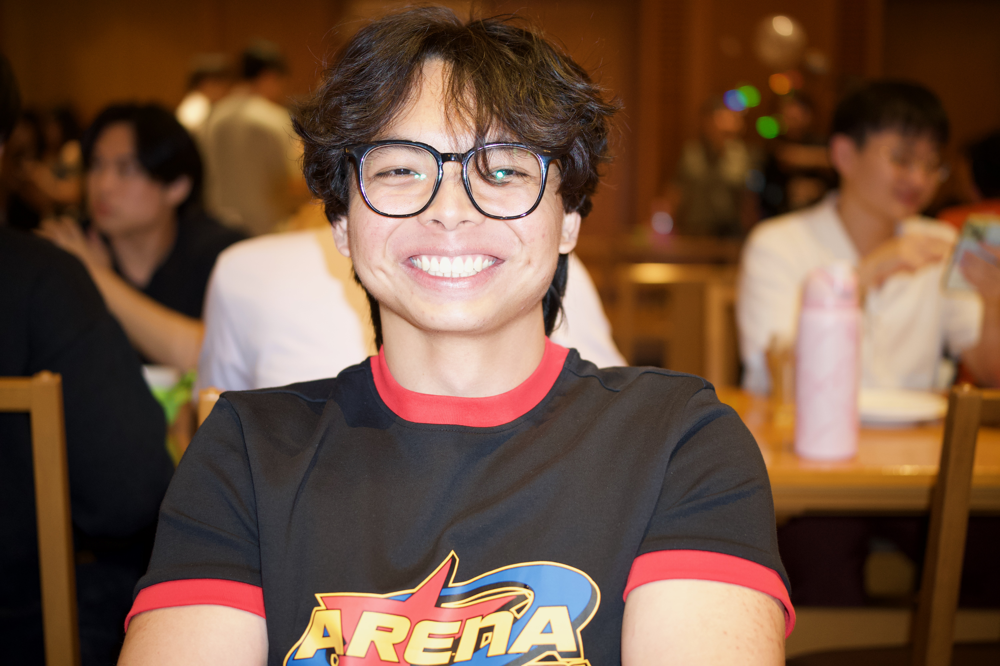
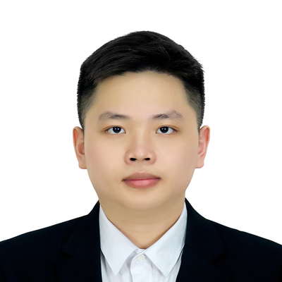

We are a team based in the [School of Computing, National University of Singapore](https://www.comp.nus.edu.sg).

You can reach us at the email `seer[at]comp.nus.edu.sg`

## Project team

### Jingchun

[[github](https://github.com/jingchunnnnn)]

* Role: Documentation
* Responsibilities: Deliverables and deadlines

### Spencer Chu

[[github](https://github.com/spencercdz)]

* Role: Team Lead, Scheduling and Tracking
* Responsibilities: Coordinate the SoCdex project, maintain and track tasks and milestones, and ensure planned work supports the tutor workflow and iteration goals.

### Minh Hoang

[[github](https://github.com/MinhHoangLeNUS)]

### Jean Doe

[[github](http://github.com/johndoe)]
[[portfolio](team/johndoe.md)]

* Role: Developer
* Responsibilities: Dev Ops + Threading

### James Doe

[[github](http://github.com/johndoe)]
[[portfolio](team/johndoe.md)]

* Role: Developer
* Responsibilities: UI
