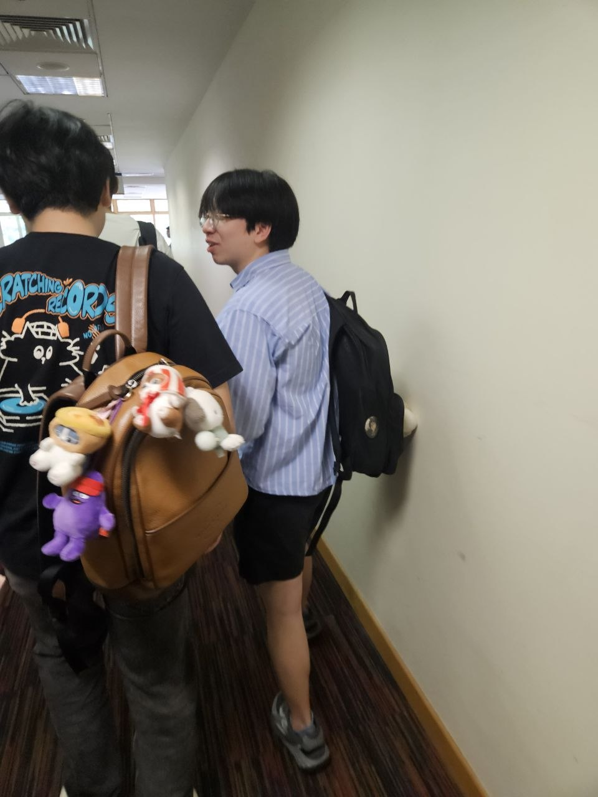

We are a team based in the [School of Computing, National University of Singapore](https://www.comp.nus.edu.sg).

You can reach us at the email `seer[at]comp.nus.edu.sg`

## Project team

### Jingchun

[[github](https://github.com/jingchunnnnn)]

* Role: Documentation
* Responsibilities: Deliverables and deadlines

### Spencer Chu

[[github](https://github.com/spencercdz)]

* Role: Team Lead, Scheduling and Tracking
* Responsibilities: Coordinate the SoCdex project, maintain and track tasks and milestones, and ensure planned work supports the tutor workflow and iteration goals.

### Minh Hoang

[[github](https://github.com/MinhHoangLeNUS)]

* Role: SoCdex Domain Model
* Responsibilities: Code Quality

### Xie Kaiwen

[[github](https://github.com/XieKaiwen)]
* Role: In Charge of Local Storage and Persistence, Integration, Git Expert
* Responsibilities: Responsible for implementing and maintaining local data storage, ensuring application data is saved and loaded reliably, and handling missing or corrupted files. Coordinates the integration of team members’ changes and helps teammates with Git workflows, branching, and resolving merge conflicts.

### Yujie

[[github](https://github.com/YujieJWang)]

* Role: Testing
* Responsibilities: Tutor UI
