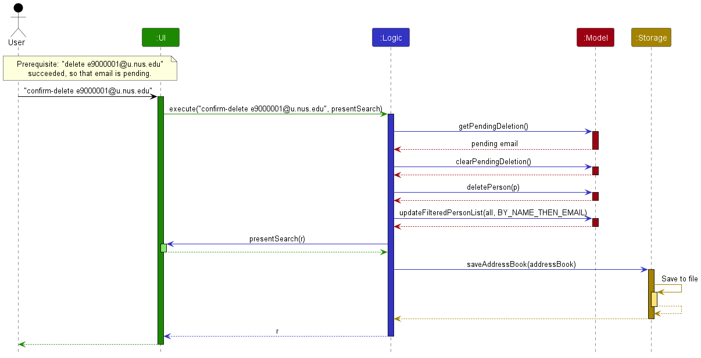

* Table of Contents
{:toc}

--------------------------------------------------------------------------------------------------------------------

## **Acknowledgements**

* _{List the sources of reused or adapted ideas, code, documentation, and third-party libraries here, with links to the originals.}_

--------------------------------------------------------------------------------------------------------------------

## **Setting up, getting started**

Refer to the guide [_Setting up and getting started_](SettingUp.md).

--------------------------------------------------------------------------------------------------------------------

## **Design**

<div markdown="span" class="alert alert-primary">

:bulb: **Tip:** The `.puml` files used to create diagrams are in `docs/diagrams`. Refer to the [_PlantUML Tutorial_ at se-edu/guides](https://se-education.org/guides/tutorials/plantUml.html) to learn how to create and edit diagrams.
</div>

### Architecture


The ***Architecture Diagram*** given above explains the high-level design of the App.

The following provides a quick overview of the main components and their interactions.

**Main components of the architecture**

**`Main`** (consisting of classes [`Main`](https://github.com/se-edu/addressbook-level3/tree/master/src/main/java/seedu/address/Main.java) and [`MainApp`](https://github.com/se-edu/addressbook-level3/tree/master/src/main/java/seedu/address/MainApp.java)) is in charge of the app launch and shut down.
* At app launch, it initializes the other components in the correct sequence, and connects them up with each other.
* At shut down, it shuts down the other components and invokes cleanup methods where necessary.

The bulk of the app's work is done by the following four components:

* [**`UI`**](#ui-component): The UI of the App.
* [**`Logic`**](#logic-component): The command executor.
* [**`Model`**](#model-component): Holds the data of the App in memory.
* [**`Storage`**](#storage-component): Reads data from, and writes data to, the hard disk.

[**`Commons`**](#common-classes) represents a collection of classes used by multiple other components.

**How the architecture components interact with each other**

The *Sequence Diagram* below shows how the components interact with each other for the scenario where the user issues the command `delete 1`.



Each of the four main components (also shown in the diagram above),

* defines its *API* in an `interface` with the same name as the Component.
* provides its functionality through a concrete `{Component Name}Manager` class that implements the corresponding API interface.

For example, the `Logic` component defines its API in `Logic.java` and implements it in `LogicManager.java`. Other components interact with a component through its interface rather than its concrete class, preventing them from coupling to that component's implementation, as illustrated in the following partial class diagram.


The sections below give more details of each component.

### UI component

The **API** of this component is specified in [`Ui.java`](https://github.com/se-edu/addressbook-level3/tree/master/src/main/java/seedu/address/ui/Ui.java)


The UI consists of a `MainWindow` and its parts, such as `CommandBox`, `ResultDisplay`, `PersonListPanel`, `PersonDetailsPanel`, and `StatusBarFooter`. All of these, including `MainWindow`, inherit from the abstract `UiPart` class, which captures common behavior among classes that represent visible GUI parts.

The `UI` component uses the JavaFX UI framework. The layouts of these UI parts are defined in matching `.fxml` files in `src/main/resources/view`. For example, [`MainWindow.fxml`](https://github.com/se-edu/addressbook-level3/tree/master/src/main/resources/view/MainWindow.fxml) specifies the layout of [`MainWindow`](https://github.com/se-edu/addressbook-level3/tree/master/src/main/java/seedu/address/ui/MainWindow.java).

The `UI` component,

* executes user commands using the `Logic` component.
* listens for changes to `Model` data so that the UI can be updated with the modified data.
* keeps a reference to the `Logic` component, because the `UI` relies on the `Logic` to execute commands.
* depends on some classes in the `Model` component because it displays `Person` objects from the model.

### Logic component

**API** : [`Logic.java`](https://github.com/se-edu/addressbook-level3/tree/master/src/main/java/seedu/address/logic/Logic.java)

Here's a (partial) class diagram of the `Logic` component:


The sequence diagram below illustrates the interactions within the `Logic` component, taking `execute("delete 1")` API call as an example.


<div markdown="span" class="alert alert-info">:information_source: **Note:** The lifeline for `DeleteCommandParser` should end at the destroy marker (X), but due to a limitation of PlantUML, it continues to the end of the diagram.
</div>

How the `Logic` component works:

1. When `Logic` is called upon to execute a command, the command is passed to an `AddressBookParser` object, which in turn creates a parser that matches the command (e.g., `DeleteCommandParser`) and uses it to parse the command.
1. This results in a `Command` object (more precisely, an object of one of its subclasses e.g., `DeleteCommand`) which is executed by the `LogicManager`.
1. The command can communicate with the `Model` when it is executed (e.g. to delete a person).<br>
   Note that although this is shown as a single step in the diagram above for simplicity, the code can require several interactions between the command object and the `Model` to complete the operation.
1. The result of the command execution is encapsulated as a `CommandResult` object which is returned from `Logic`.

Here are the other classes in `Logic` (omitted from the class diagram above) that are used for parsing a user command:


How the parsing works:
* When called upon to parse a user command, the `AddressBookParser` class creates an `XYZCommandParser` (`XYZ` is a placeholder for the specific command name, e.g., `AddCommandParser`). The parser uses the other classes shown above to parse the user command and create an `XYZCommand` object (e.g., `AddCommand`). The `AddressBookParser` returns that object as a `Command` object.
* All `XYZCommandParser` classes, such as `AddCommandParser` and `DeleteCommandParser`, implement the `Parser` interface so they can be treated similarly where appropriate, for example during testing.

### Model component
**API** : [`Model.java`](https://github.com/se-edu/addressbook-level3/tree/master/src/main/java/seedu/address/model/Model.java)


The `Model` component,

* stores the address book data i.e., all `Person` objects (which are contained in a `UniquePersonList` object).
* identifies each `Person` by its canonical NUS email: `Person#isSamePerson(Person)` compares only the `Email` values, so `UniquePersonList` accepts persons with equal names but rejects a second person with the same email. `Person#equals(Object)` and `Person#hashCode()` still compare every stored field, so a change to any saved field remains detectable.
* stores the `Person` objects selected by the current filter, such as search results, in a separate _filtered_ list. It exposes this list as an unmodifiable `ObservableList<Person>` that the UI can observe and bind to, so the UI updates when the list changes.
* stores a `UserPrefs` object that represents the user’s preferences (currently, just the GUI settings). This is exposed to the outside as a `ReadOnlyUserPrefs` object.
* does not depend on any of the other three components (as the `Model` represents data entities of the domain, they should make sense on their own without depending on other components)

<div markdown="span" class="alert alert-info">:information_source: **Note:** The alternative, arguably more object-oriented, design below keeps a unique list of tags in `AddressBook`, and each `Person` references tags from that list. This lets `AddressBook` maintain one `Tag` object per unique tag instead of each `Person` holding its own `Tag` objects.<br>


</div>


### Storage component

**API** : [`Storage.java`](https://github.com/se-edu/addressbook-level3/tree/master/src/main/java/seedu/address/storage/Storage.java)


The `Storage` component,
* can save both address book data and user preference data in JSON format, and read them back into corresponding objects.
* is implemented by `StorageManager`, which delegates the actual JSON file access to `JsonAddressBookStorage` and `JsonUserPrefsStorage` (one class per data file).
* depends on some classes in the `Model` component (because the `Storage` component's job is to save/retrieve objects that belong to the `Model`)

### Common classes

Classes used by multiple components are in the `seedu.address.commons` package.

--------------------------------------------------------------------------------------------------------------------

## **Implementation**

This section describes some noteworthy details on how certain features are implemented.

### Enrolment storage (v1.2)

Each `Person` owns an immutable list of `Enrolment` values. `getEnrolments()` returns that list in stored order. `withEnrolments(Collection<Enrolment>)` returns a new profile, preserving all existing identity, contact, remark, and tag fields. The extended `Person` constructor and `PersonBuilder.withEnrolments(...)` support fixtures and dependent features. `Person` has a complete constructor taking name, email, optional Telegram, optional GitHub, sample classification, remark, tags, and enrolments. Its short creation constructor supplies `sample=false`, an empty remark, and empty tags/enrolments. Phone and address are removed. `withContacts` and `withEnrolments` replace only their named fields; `RemarkCommand` and the test copy builder preserve every other field. Sample loaders must use the full constructor with an explicit classification.

An enrolment contains `ModuleCode`, `Semester`, `Optional<Section>`, and `Optional<Team>`. Missing affiliations are `Optional.empty()`, never the UI label `Not assigned`. Module codes accept 2 to 4 ASCII letters, four ASCII digits, and up to 3 final ASCII letters, and are stored uppercase. Semesters accept `AYyy/yy S1` or `AYyy/yy S2` with consecutive years interpreted within 2000–2099; they are stored uppercase with a single separator space. Section and team labels allow 1 to 30 ASCII letters, digits, spaces, or hyphens, including at least one letter or digit. They preserve case. Input normalisation trims spaces/tabs and collapses their internal runs for semesters and affiliation labels; line breaks and other unsupported characters remain invalid.

`Enrolment.hasSameKey` compares module and semester only. `Person` rejects repeated keys even if their affiliations differ. Different students may own identical enrolments. Full enrolment and profile equality/hash codes include every enrolment field, so affiliation changes remain detectable by persistence. `Enrolment.DISPLAY_ORDER` sorts by academic start year, semester number, and module code for the profile-view feature; storage retains list order.

`JsonAdaptedEnrolment` stores a human-editable object inside each profile:

```json
"enrolments": [
  {"module": "CS2103T", "semester": "AY26/27 S1", "section": "T12", "team": "SEED"},
  {"module": "CS2113T", "semester": "AY26/27 S2", "section": null, "team": null}
]
```

Otherwise valid older profiles with no `enrolments` property load with an empty list. An explicit empty array also means no enrolments; an explicit null array, null item, malformed item, missing module/semester, invalid value, or repeated key rejects the entire load. Omitted or null `section` and `team` mean absence; empty strings are invalid. Stored strings must already equal the validated value's canonical form. Loading does not silently correct lowercase modules, semester spacing, or affiliation whitespace. Equivalent JSON escapes decode to the same valid string.

This increment adds model and persistence support. The user-facing `enrol` command belongs to #64, and complete enrolment display was delivered by #65 (see [Profile viewing (v1.3)](#profile-viewing-v13)). The #58 storage contract protects rejected enrolment files and restores complete enrolments after failed saves. The integrated #59 identity rule allows same-name students with distinct canonical emails; storage still rejects non-canonical stored emails alongside enrolment validation. This schema's legacy compatibility does not override those features' email or sample-classification requirements.

### Storage safety (v1.2)

`MainApp.initModelManager` loads the whole roster before creating a writable model. A missing file produces an empty writable roster without creating sample records. A failed load produces an empty `ModelManager` with `isReadOnly()` fixed to `true` for that session. The initial recovery explanation and persistent status-bar warning distinguish this view from a genuinely empty saved roster. Recovery requires a valid file and a restart; no in-session switch enables writes.

The shared command contract is:

* `Command.isReadOnly()` defaults to `false`. Commands that only read data or change the visible filter override it to return `true`. The existing `find`, `list`, `help`, and `exit` commands do so. `sample load` and profile mutations retain the default, so the recovery gate applies before execution.
* Commands validate and change the model through `execute(Model)`; they must not save directly. `LogicManager` owns persistence and returns the successful `CommandResult` only after storage succeeds.
* `Model.createRestorePoint()` captures the immutable roster records, current filter, and display comparator and returns a restoration action. `LogicManager` restores them after an execution or save failure. A read-only command that changes records is rejected and rolled back. Full record equality detects no-op changes so they do not rewrite the file.
* `MainWindow` captures the selected profile before execution and restores it after a rejected command, after model restoration. Success text is not displayed before `LogicManager` returns. Normal window close saves preferences only; it does not save the roster.

`createRestorePoint()` reuses the search display restore point so failed saves preserve both the result filter and comparator. The profile view from #65 preserves the same selection restoration contract for its complete detail view. Changes to profile equality must include every persisted field so no-op detection remains correct.

`JsonAddressBookStorage` writes the complete candidate into a temporary file in the destination directory and closes it before an atomic replacement. Unsupported or failed atomic replacement is an error; there is no non-atomic fallback and the previous destination is not truncated first. Failed first saves leave no roster destination. Temporary-file cleanup is attempted on success and failure, and a cleanup error after a committed replacement is logged rather than reported as a failed save. Save attempts reject symbolic-link destinations and existing read-only files.

`JsonUtil` distinguishes a definitely missing path from a path whose existence cannot be established, and requires exactly one complete non-null JSON document. `FileUtil` reads strict UTF-8; malformed bytes are rejected instead of replaced with replacement characters. Trailing garbage or additional JSON roots are rejected rather than silently ignored. Malformed JSON, invalid records, duplicate identities, and invalid adapter values reject the complete load. No records are silently dropped. This increment retains the existing identity and schema rules; NUS email identity, sample classification, and enrolments are separate changes.

Protection covers detected failures, not power loss or hardware faults. The app does not implement backups, cross-process locking, or concurrent external file-edit detection. Recovery and no-op tests use temporary files and injected failures. The UI acceptance check additionally verifies the persistent warning and selected-row restoration.

The startup guidance names both `student add` and fictional sample loading. Samples are never created automatically.

### Identifier search (v1.3)

`FindCommandParser` treats the complete argument as one literal query. It rejects controls and line breaks before trimming spaces and tabs, changes internal tabs to spaces, and checks the 100-code-point limit. `AddressBookParser` also validates the original command before trimming so that trailing line breaks cannot disappear before validation.

`IdentifierContainsQueryPredicate` compares the query with names, canonical emails and present Telegram/GitHub values using `Locale.ROOT` lowercase and contiguous substring matching. It removes exactly one leading `@` for Telegram comparison only; an empty remaining Telegram query never matches. Other fields retain the original query, so `@` can still match email addresses. The comparisons are combined with OR, returning each profile once. Absent contacts are not converted to display labels. It does not split words, remove accents, search enrolments, or interpret prefixes, regular expressions, or wildcards.

`ModelManager` exposes a `SortedList` over its `FilteredList`. The comparator overload of `updateFilteredPersonList` filters the complete roster and sorts only the display by lowercase name, then lowercase email. Stored order and records remain unchanged. Existing commands using the single-argument overload retain their previous unsorted display behavior. Index-based commands operate on the displayed list.

`MainWindow` displays a snapshot panel, so a pending search cannot change the previous results or selection. `LogicManager.execute` accepts a search-presentation callback and captures the current filter and comparator before execution. The callback constructs every result card in a detached panel, selects the sole result (or clears selection), and applies CSS/layout before replacing the previous panel. Virtualized cells reuse those prepared cards, including results initially off screen. Success feedback follows that replacement. A runtime or FXML-loading failure restores the previous model filter/order, retains the old panel, and reports the specified retry message through `CommandException`. Parse failures also leave the old panel untouched. The UI-side `DisplayedCommandExecutor` refreshes changed snapshots after both successful and failed commands, preserving any surviving selection. Before executing another command, it verifies that the snapshot still equals the model list in order and content. If a refresh previously failed, the next submission only refreshes the display and asks the tutor to check the indexes and resubmit; it never executes an index taken from stale rows. These callbacks can be regression-tested with real logic and storage without starting JavaFX. [Profile viewing (v1.3)](#profile-viewing-v13) extends this display with a complete profile panel.

`FindCommand.isReadOnly()` returns true, so `LogicManager` skips persistence for successful searches, including zero matches. Other read-only commands and unchanged rosters also skip persistence. Data-changing commands use the storage recovery and atomic-save contract above.

Search does not change identity or field validation. Email identity allows profiles with identical names when their canonical emails differ. Names follow the Feature 3 rule: Unicode text is accepted, surrounding and repeated spaces and tabs are normalised, and the normalised name must contain 1 to 100 code points, include at least one visible character, and contain no forward slash, control character or malformed Unicode. Stored names are stricter: `JsonAdaptedPerson` validates each decoded stored name with the same rule and then requires it to equal the resulting `Name#fullName`, so a stored name with surrounding spaces or tabs, tabs between words or repeated spaces is rejected rather than corrected, and the whole load fails; `MainApp` then opens the read-only recovery session described in [Storage safety (v1.2)](#storage-safety-v12). Predicate and command tests cover independent same-name records, including an identical-name roster ordered by email.

Verification covers Telegram-only and GitHub-only matches, shared handles, multiple-field matches without duplicates, `@`/`@@` handling, absent contacts, literal phrases, partial emails, case and locale independence, whitespace, accents, punctuation, Unicode length boundaries, repeated searches, ordering, unchanged roster data, and the absence of save attempts. Manual acceptance additionally checks visible selection, error preservation, and a 500-profile timing measurement. The measurement is initial evidence and does not certify the reference-hardware NFR.

For a repeatable JavaFX check using fictional data, build with `./gradlew testClasses shadowJar`, then run the following from the repository root with a JavaFX-enabled JDK 25 (macOS/Linux classpath syntax):

```text
java -cp build/classes/java/test:build/libs/addressbook.jar seedu.address.ui.ContactSearchAcceptance
```

On Windows, replace the classpath separator `:` with `;`. This opt-in utility drives the real command box, checks selection and rendering-failure recovery, and refuses search save attempts. It writes its fictional files and screenshot under `build/reports/contact-search`. It measures four queries over 500 profiles with 1,000 enrolments, recording the first invocation and five repeats through command handling, feedback, layout and a scene snapshot. Report the printed runtime, actual machine specifications and tested commit with results. This is programmatic UI evidence, not manual keyboard input or reference-hardware certification; reference-condition acceptance belongs to #80.


### Profile viewing (v1.3)

`ViewCommandParser` rejects line breaks, trims spaces and tabs, and counts tokens before validating the email. An empty argument gives the missing-email message and two or more tokens give the extra-argument message, so `view /email EMAIL` is reported as an extra argument rather than an invalid email. A single token is canonicalised by `ParserUtil.parseEmail`.

`ViewCommand` looks up the canonical email in the complete roster, not the displayed list, so hidden students can be viewed. If the target is already displayed, the filter and comparator are kept. Otherwise the command shows all students with `PersonOrder.BY_NAME_THEN_EMAIL`. It returns `CommandResult.forTarget`, and `isReadOnly()` is true, so `LogicManager` never saves and the command remains available during read-only recovery. `Command#getDisplayFailureMessage` lets the command replace the generic profile-display failure message with its own retry guidance. The rollback path is unchanged.

`MainWindow` places `PersonListPanel` and `PersonDetailsPanel` side by side in a `SplitPane`. The details panel follows the list selection. A sole `find` result, `view`, `student add`, `edit` and a revealed duplicate therefore all show the complete profile, and a cleared selection shows the selection prompt. For a command presentation, `prepareAndReplaceDisplay` builds both panels in detached scenes with the window stylesheets, applies CSS and layout, then swaps both placeholders. If either swap fails, both previous panels are restored before the error reaches `LogicManager`, so failed presentation never shows a new list with a stale profile. A selection made with the mouse or keyboard prepares a new details panel the same way. If that fails, the previous profile stays visible, the result display shows `Messages.MESSAGE_PROFILE_DISPLAY_FAILURE`, and the list selection is restored to the displayed profile.

`PersonCard.enrolmentLine` and `PersonCard.enrolmentText` format enrolments in `Enrolment.DISPLAY_ORDER`, and `PersonDetailsPanel.profileLines` lists the profile fields in a fixed order. Both are static and can be tested without starting JavaFX. `Not provided`, `Not assigned` and `Enrolments: none` are display text only and are never stored.

### \[Proposed\] Undo/redo feature

#### Proposed Implementation

The proposed undo/redo mechanism is facilitated by `VersionedAddressBook`. It extends `AddressBook` with an undo/redo history, stored internally as an `addressBookStateList` and `currentStatePointer`. Additionally, it implements the following operations:

* `VersionedAddressBook#commit()` — Saves the current address book state in its history.
* `VersionedAddressBook#undo()` — Restores the previous address book state from its history.
* `VersionedAddressBook#redo()` — Restores a previously undone address book state from its history.

These operations are exposed in the `Model` interface as `Model#commitAddressBook()`, `Model#undoAddressBook()` and `Model#redoAddressBook()` respectively.

Given below is an example usage scenario and how the undo/redo mechanism behaves at each step.

Step 1. The user launches the application for the first time. The `VersionedAddressBook` will be initialized with the initial address book state, and the `currentStatePointer` pointing to that single address book state.


Step 2. The user executes `delete 5` command to delete the 5th person in the address book. The `delete` command calls `Model#commitAddressBook()`, causing the modified state of the address book after the `delete 5` command executes to be saved in the `addressBookStateList`, and the `currentStatePointer` is shifted to the newly inserted address book state.


Step 3. The user executes `add n/David …​` to add a new person. The `add` command also calls `Model#commitAddressBook()`, causing another modified address book state to be saved into the `addressBookStateList`.


<div markdown="span" class="alert alert-info">:information_source: **Note:** If a command fails its execution, it will not call `Model#commitAddressBook()`, so the address book state will not be saved into the `addressBookStateList`.

</div>

Step 4. The user now decides that adding the person was a mistake, and decides to undo that action by executing the `undo` command. The `undo` command will call `Model#undoAddressBook()`, which will shift the `currentStatePointer` once to the left, pointing it to the previous address book state, and restores the address book to that state.


<div markdown="span" class="alert alert-info">:information_source: **Note:** If the `currentStatePointer` is at index 0, pointing to the initial AddressBook state, then there are no previous AddressBook states to restore. The `undo` command uses `Model#canUndoAddressBook()` to check if this is the case. If so, it will return an error to the user rather
than attempting to perform the undo.

</div>

The following sequence diagram shows how an undo operation goes through the `Logic` component:


<div markdown="span" class="alert alert-info">:information_source: **Note:** The lifeline for `UndoCommand` should end at the destroy marker (X), but due to a limitation of PlantUML, it continues to the end of the diagram.

</div>

Similarly, how an undo operation goes through the `Model` component is shown below:


The `redo` command does the opposite — it calls `Model#redoAddressBook()`, which shifts the `currentStatePointer` once to the right, pointing to the previously undone state, and restores the address book to that state.

<div markdown="span" class="alert alert-info">:information_source: **Note:** If the `currentStatePointer` is at index `addressBookStateList.size() - 1`, pointing to the latest address book state, then there are no undone AddressBook states to restore. The `redo` command uses `Model#canRedoAddressBook()` to check if this is the case. If so, it will return an error to the user rather than attempting to perform the redo.

</div>

Step 5. The user then decides to execute the command `list`. Commands that do not modify the address book, such as `list`, will usually not call `Model#commitAddressBook()`, `Model#undoAddressBook()` or `Model#redoAddressBook()`. Thus, the `addressBookStateList` remains unchanged.


Step 6. The user executes `clear`, which calls `Model#commitAddressBook()`. Since the `currentStatePointer` is not pointing at the end of the `addressBookStateList`, all address book states after the `currentStatePointer` will be purged. Reason: It no longer makes sense to redo the `add n/David …​` command. This is the behavior that most modern desktop applications follow.


The following activity diagram summarizes what happens when a user executes a new command:


#### Design considerations:

**Aspect: How undo & redo execute:**

* **Alternative 1 (current choice):** Saves the entire address book.
  * Pros: Easy to implement.
  * Cons: May have performance issues in terms of memory usage.

* **Alternative 2:** Individual command knows how to undo/redo by
  itself.
  * Pros: Will use less memory (e.g. for `delete`, just save the person being deleted).
  * Cons: We must ensure that the implementation of each individual command is correct.

_{more aspects and alternatives to be added}_

### \[Proposed\] Data archiving

_{Explain here how the data archiving feature will be implemented}_

### NUS email identity (v1.2)

`Email` contains the single validation and canonicalisation rule used by both commands and storage. `Email#isValidEmail(String)` ignores only surrounding spaces and tabs and rejects any non-ASCII character before lowercasing, so a character such as the Kelvin sign cannot become an ASCII letter. It then lowercases the value with `Locale.ROOT` and requires a local part of 1 to 64 ASCII letters, ASCII digits, `.`, `_`, `+`, or `-` that starts and ends with an ASCII letter or digit and contains no consecutive dots, followed by exactly `@u.nus.edu`. The constructor stores this canonical value, so `Email#equals` and `Email#hashCode` compare canonical emails. Dots and plus suffixes remain significant, no aliases are inferred, and no network check is made: the rule is a local syntax check, not account verification.

`ParserUtil#parseEmail` delegates to `Email` instead of trimming the input itself, so command input may contain uppercase letters and surrounding spaces or tabs. Stored data is stricter. `JsonAdaptedPerson` validates each stored email with the same rule and then requires the decoded stored string to equal the resulting `Email#value`. A syntax-valid but non-canonical stored email, such as one with uppercase letters or surrounding spaces or tabs, is rejected instead of corrected, so the app never rewrites a stored identity automatically. `JsonSerializableAddressBook` also rejects a data file in which two records share a canonical email. Any rejected record makes the whole load fail; no record is skipped or partially imported. `MainApp` then opens the read-only recovery session described in [Storage safety (v1.2)](#storage-safety-v12), so the incompatible file is not overwritten.

Identity and equality are deliberately separate. `Person#isSamePerson` compares canonical emails and drives duplicate detection in `UniquePersonList`, `AddCommand`, and `EditCommand`, so students with equal names can coexist. `Person#equals` and `Person#hashCode` compare every stored field. Enrolments, contacts and sample classification also participate in `equals` and `hashCode`, so changes remain detectable.

**Design consideration:** names are not unique among students and are not a reliable key. A canonical NUS email gives each student one unambiguous key for lookup, editing, and duplicate checks. The cost is that data files from earlier versions with other email addresses are no longer valid; such files open in read-only recovery instead of being replaced. Requiring stored emails to be canonical keeps stored email values consistent with the form written by the app, at the cost of rejecting hand-edited emails that use uppercase letters or surrounding spaces or tabs.

### Optional contacts and sample classification (v1.2)

`Person` stores an `Optional<Telegram>`, an `Optional<GitHub>`, and a `boolean` sample classification. An absent contact is `Optional.empty()`, never display text such as `Not provided`. `Telegram` and `GitHub` remove surrounding spaces and tabs from input, and `Telegram` also removes one leading `@`. Both keep the letter case of the value and compare values case-sensitively. The literal word `clear` is an ordinary value. `Person#equals` and `Person#hashCode` include all three fields, so a contact change, a case-only contact change, or a classification change is a real change. `Person#isSamePerson` still compares only canonical emails.

`Person` has a complete constructor taking name, email, optional Telegram, optional GitHub, sample classification, remark, tags, and enrolments. The short creation constructor supplies `sample=false`, an empty remark, and empty tags/enrolments. `EditCommand` uses `Person#withContacts`; `RemarkCommand`, `Person#withEnrolments`, and the test copy builder preserve every other field. `AddCommandParser` accepts optional contacts when creating a non-sample profile. `SampleDataUtil` uses the complete constructor with `sample=true`; it is not used at startup. Phone and address are no longer profile fields.

`JsonAdaptedPerson` stores the fields as follows:

```json
"telegram": "Alex_Tan",
"github": null,
"sample": false
```

`telegram` and `github` are optional; an omitted property or `null` means absence. `sample` is required and must be a JSON boolean. The adapter reads all three as Jackson `JsonNode` values through `@JsonSetter` methods, so text, numbers, arrays, and objects are rejected instead of being coerced. After name and email, `toModelType` checks the Telegram handle, then the GitHub username, then the classification. A stored contact must be a JSON string, must be valid, and must already equal its saved form (`Telegram#value` or `GitHub#value`). For example, a stored `"@alex_tan"` or `" alex_tan"` is rejected with `MESSAGE_NON_NORMALISED_CONTACT` instead of being corrected. Comparisons use the decoded string, so equivalent JSON escapes are accepted. A missing, `null`, or non-boolean `sample` is rejected. The writer always emits `sample` and writes `null` for an absent contact. Any rejection makes the whole load fail, and `MainApp` opens the read-only recovery session described in [Storage safety (v1.2)](#storage-safety-v12).

`PersonCard` shows a `Telegram:` line and a `GitHub:` line, using `Not provided` for absence. It also shows a `Fictional sample` label, which is visible and managed only when `Person#isSample()` is true.

`JsonAdaptedPerson` explicitly rejects the presence of retired `phone` and `address` properties (including null). This prevents Jackson from ignoring those properties and silently discarding legacy values. An otherwise valid profile without optional contacts still loads with absence; missing/non-boolean sample classification rejects loading. No migration or inferred classification runs automatically.

### Fictional sample loading (v1.2)

`AddressBookParser` recognises the exact lowercase `sample load` command after removing surrounding spaces and tabs. Repeated spaces or tabs between the two words are accepted. Missing `load`, extra arguments, another subcommand, or different letter case in `load` produces the same usage message. An uppercase root command such as `Sample` uses the normal unknown-command error. The shared single-line guard rejects line breaks and control characters before parsing.

`SampleDataUtil` is the single production fixture provider. It returns five classified fictional profiles and five enrolments in name-and-email display order. The fixture covers equal names with distinct canonical emails, optional contacts, multiple enrolments, missing contacts, missing affiliations, and a profile with no enrolments. The application does not call this provider during startup.

`SampleCommand` first checks that the writable roster is empty. It then copies and validates the complete fixture before changing the model. Validation checks the profile count, enrolment count, and sample classification of every profile. Only a complete fixture replaces the empty roster. The command applies `PersonOrder.BY_NAME_THEN_EMAIL` to the displayed list and returns a selection update with no explicit target, so the GUI clears its selection and shows `Select a student to view their profile.`

The command does not write storage directly. `LogicManager` applies the shared persistence transaction after command execution. A successful save reports success. A failed save restores the empty model, prior display state, and prior file. `SampleCommand#getSaveFailureMessage` supplies the sample-specific failure text after rollback. Recovery mode blocks the command before fixture creation because it is a data-changing command. Repeated loading stops at the non-empty precondition and performs no save.

The full workflow tests cover parsing, exact fixture contents, sorted display, no selection target, persistence and restart, repeated loading, an injected invalid fixture, an injected first-save failure, and read-only recovery. Selective `sample clear` is outside v1.2 because it requires safe handling of mixed real and fictional data. The existing `clear` command is not reused because it deletes every record.

### Student creation and contact editing (v1.2)

`AddressBookParser` dispatches `student add` to `AddCommandParser` and `edit` to `EditCommandParser`. Inherited `add` and indexed edit are retired. The edit subset accepts only `/email`, `/telegram` and `/github`; name/email changes and affiliations remain for v1.3.

`SlashPrefixTokenizer.tokenize(args, usage, Prefix...)` scans slash tokens at space/tab boundaries and checks preamble, malformed tokens, unknown prefixes and duplicates in encounter order. It retains an embedded slash such as `AY26/27`. `SlashArguments.getRequired` and `getOptional` report missing or blank values with usage. Parsers access and validate values in documented order, then commands check target existence/identity. Thus a later structural error precedes invalid field values, but invalid values precede model lookup. The shared single-line guard runs before any trimming.

`EditCommand` distinguishes omission (outer `Optional.empty()`) from clearing (present empty contact) and replacement. Only exact lowercase `clear` clears a contact; `@clear` stores a Telegram handle and `Clear` stores either contact. Full-record equality preserves case-only display changes. `PersonOrder.BY_NAME_THEN_EMAIL` is shared by search, creation, editing and duplicate reveal.

`CommandResult.forTarget` requests an explicit profile selection. `MainWindow` creates all cards in a detached panel, selects and scrolls to that target, and performs layout before replacing the old panel. This callback runs even when result rows are unchanged, so a no-op can select its target. A failed preparation restores the model/filter/comparator and leaves the old complete panel intact, with no save. On successful preparation, persistence still completes before success is returned. Save failure restores model state; `DisplayedCommandExecutor` refreshes the rolled-back snapshot, and `MainWindow` restores the prior selected profile. The existing stale-display guard remains mandatory before subsequent commands.

`DuplicateStudentException` is a creation rejection carrying the existing profile. `LogicManager` first restores prior data, then reveals the existing profile in the full sorted roster and requests targeted presentation without saving. Only a successfully presented duplicate rejection bypasses the window's ordinary selection restoration. If presentation fails, it restores the prior filter/order and uses the no-change presentation error. Normal no-op edits return `No values changed.` and target selection while equality suppresses saving.

`Command.getSaveFailureMessage(defaultMessage)` supplies creation/edit-specific feedback only after rollback; other commands retain the existing storage error. It is not used for display failures. UI refresh failures following a completed save from other commands retain the existing guard and never rerun the saved mutation.

Verification includes full parser boundaries, schema recovery and unchanged source bytes, duplicate reveal, hidden-target editing, literal clearing, no-op saves, case-only updates, classification/enrolment preservation, failed-save retry and presentation failures. Full profile display and enrolment entry remain separate increments.

**Design consideration:** a required, explicit classification means that sample-management features never have to infer whether a record is real. The cost is compatibility: every data file saved before this change has no `sample` property and opens in read-only recovery with its bytes preserved, and the User Guide explains the manual migration. Strict stored handles follow the same reasoning as stored emails: the app never silently rewrites a value in the data file.


--------------------------------------------------------------------------------------------------------------------

## **Documentation, logging, testing, dev-ops**

* [Documentation guide](Documentation.md)
* [Testing guide](Testing.md)
* [Logging guide](Logging.md)
* [DevOps guide](DevOps.md)

--------------------------------------------------------------------------------------------------------------------

## **Appendix: Requirements**

### Product scope

**Target user profile**:

* is an NUS School of Computing tutor who supports students in project-based modules
* manages several tutorial sections and project teams across one or more module-semester cohorts
* needs to identify and contact the correct student without interrupting a tutorial, consultation, or project discussion
* may know a student only by a name, NUS email, Telegram handle, or GitHub username
* prefers a keyboard-first desktop application for fast, focused retrieval of local roster information
* currently cross-references Canvas, spreadsheets, technical platforms, and personal notes to verify a student's identity and affiliations

**Value proposition**: SoCdex gives NUS School of Computing tutors fast access to student contact details, identities, and tutorial or project-team affiliations, organised by module and semester. It helps tutors identify and reach the correct student without repeatedly cross-referencing Canvas, spreadsheets, technical platforms, and personal notes.

**Scope boundary**: SoCdex stores only the information needed for this focused workflow: student name, NUS email, optional Telegram or GitHub identifiers, and module-semester enrolments with optional tutorial-section and project-team affiliations. It does not manage grades, attendance, submissions, timetables, LMS content, project collaboration, bulk institutional imports, free-form tutor notes, or disciplinary and assessment records.


### User stories

These stories describe planned tutor outcomes, not currently implemented features. The backlog includes core requirements, supporting features, and future ideas; inclusion does not commit the team to implementing every story this semester.

Priorities:

* High (`* * *`): required outcomes in the agreed M1–M8 product backlog.
* Medium (`* *`): supporting or post-MVP capabilities to consider after the core workflow is reliable.
* Low (`*`): future extensions outside the current-semester scope.

Story IDs are retained from the project notes for traceability. Priorities follow the agreed mapping in issue #39: M1–M8 are high, S1–S12 are medium, and C1–C10 are low.

| Priority | ID | As a … | I can … | So that … |
| --- | --- | --- | --- | --- |
| `* * *` | M1 | tutor | load fictional sample records | I can explore SoCdex safely before entering my own roster |
| `* * *` | M2 | tutor | clear the fictional sample records | I can start with an empty roster before entering real class information |
| `* * *` | M3 | tutor | add a student’s identity and contact details | I can identify and contact the correct person |
| `* * *` | M4 | tutor | record a student’s module-semester, tutorial section, and project-team affiliations | I can find the student in the correct teaching context |
| `* * *` | M5 | tutor | search using a name, NUS email, Telegram handle, or GitHub username | I can identify a student from the identifier available to me |
| `* * *` | M6 | tutor | view a student profile and all its enrolments | I can verify contact details and affiliations together |
| `* * *` | M7 | tutor | update a student’s editable contact details or affiliations | the roster stays useful after assignments change |
| `* * *` | M8 | tutor | remove a profile only after confirming the exact student | I do not accidentally lose their contact details and enrolments |
| `* *` | S1 | tutor | list students in one tutorial section | I can prepare for a section-specific activity |
| `* *` | S2 | tutor | list students in one project team | I can quickly identify the members of that team |
| `* *` | S3 | tutor | list students in a module-semester cohort | I can review the roster for the class I teach |
| `* *` | S4 | tutor | list the module-semester rosters I manage | I can choose the correct cohort before working with students |
| `* *` | S5 | tutor | see how many students are in a module-semester roster | I can notice when a roster may be incomplete |
| `* *` | S6 | tutor | see a cohort ordered by student name | I can scan it predictably during preparation |
| `* *` | S7 | tutor | identify enrolments missing a tutorial section or project team | I can correct incomplete affiliation records |
| `* *` | S8 | tutor | remove a student from one module-semester while keeping their profile | a past cohort does not clutter the current roster |
| `* *` | S9 | tutor | use in-app help | I can discover the next valid command without leaving SoCdex |
| `* *` | S10 | tutor | receive an actionable explanation when an entry is rejected | I can correct it without guessing |
| `* *` | S11 | tutor | create a local roster backup | I can protect contact and affiliation data before a device change or recovery event |
| `* *` | S12 | tutor | restore a local roster backup after confirming its contents | I can recover from data loss |
| `*` | C1 | tutor | combine section and team filters | I can narrow a large cohort to the exact group I need |
| `*` | C2 | tutor | copy an available contact identifier from a profile | I can contact the correct student with fewer transcription errors |
| `*` | C3 | tutor | view profiles with incomplete optional details | I can decide which contact information to request later |
| `*` | C4 | tutor | import a structured roster file | I can avoid manually re-entering an existing class list |
| `*` | C5 | tutor | preview import problems before any records are added | invalid data does not partly corrupt the roster |
| `*` | C6 | tutor | export a module-semester contact list | I can use it in an approved offline preparation workflow |
| `*` | C7 | tutor | archive a completed module-semester roster | active workspaces are uncluttered without deleting useful history |
| `*` | C8 | tutor | restore an archived cohort to active view | I can answer follow-up questions about a past class |
| `*` | C9 | tutor | choose whether cohort results are grouped by section or team | I can prepare the relevant group activity |
| `*` | C10 | tutor | see which contact identifier is missing from a cohort | I can follow up on incomplete records |

### Use cases

The following use cases describe **planned SoCdex behaviour**, not features already implemented in the inherited AB3 application.
For all use cases, the **System** is **SoCdex** and the **Actor** is a **tutor**.
A student profile contains identity and contact details; each enrolment records one module-semester and its optional tutorial section and project team.

#### UC1: Add a student profile

**Preconditions:** Stored data has loaded successfully and storage is writable. The tutor has the student's name and NUS email.

**Main success scenario (MSS)**

1. Tutor requests a new profile with the student's name and NUS email, optionally supplying Telegram and GitHub identifiers.
1. SoCdex validates the supplied fields and checks that the normalised NUS email is not already used.
1. SoCdex saves the new profile without creating any enrolments or changing existing profiles.
1. SoCdex confirms creation and displays the saved profile, showing absent optional contact details as not provided.

    Use case ends.

**Extensions**

* 2a. Required details are missing or a supplied field is invalid.

    * 2a1. SoCdex explains the validation problem and creates nothing.
    * 2a2. Tutor corrects the request.

      Use case resumes at step 2.

* 2b. Another profile already uses the normalised NUS email.

    * 2b1. SoCdex reports the duplicate and leaves the existing profile unchanged.
    * 2b2. Tutor checks the existing profile rather than creating another record for the same email.

      Use case ends.

* 3a. Saving fails.

    * 3a1. SoCdex reports failure and preserves the prior in-memory roster and saved file; no partial profile remains.
    * 3a2. Tutor corrects the storage problem before retrying.

      Use case resumes at step 1.

#### UC2: Add a module-semester enrolment

**Preconditions:** The student profile exists, stored data has loaded successfully, and storage is writable.

**Main success scenario (MSS)**

1. Tutor requests an enrolment using the student's NUS email, module, and semester, optionally supplying a tutorial section and project team.
1. SoCdex validates the fields, locates the profile, and checks that it has no enrolment for the same module-semester.
1. SoCdex saves one enrolment linked to that profile, preserving the student's contact details and all existing enrolments.
1. SoCdex displays the saved module-semester and affiliations, showing an omitted section or team as not assigned.

    Use case ends.

**Extensions**

* 2a. Required fields are missing or any supplied value is invalid.

    * 2a1. SoCdex explains the input problem and adds nothing.
    * 2a2. Tutor corrects the request.

      Use case resumes at step 2.

* 2b. The NUS email does not identify an existing profile.

    * 2b1. SoCdex reports the missing student and creates neither a profile nor an enrolment.
    * 2b2. Tutor checks the email or completes UC1 before trying again.

      Use case resumes at step 1.

* 2c. The student already has an enrolment for the same module and semester.

    * 2c1. SoCdex reports the duplicate and preserves the existing affiliations.
    * 2c2. Tutor uses UC4 if the existing section or team needs updating.

      Use case ends.

* 3a. Saving fails.

    * 3a1. SoCdex reports failure and preserves the prior roster and saved file without leaving a partial enrolment.
    * 3a2. Tutor corrects the storage problem before retrying.

      Use case resumes at step 1.

#### UC3: Identify a student in the correct teaching context

**Preconditions:** The tutor has an identifier from a student interaction and knows the module and semester to check.

**Main success scenario (MSS)**

1. Tutor requests a search using a name, NUS email, Telegram handle, or GitHub username.
1. SoCdex searches the complete roster and displays matching profiles with distinguishing identifiers and enrolment details.
1. Tutor requests the intended student's full profile using its unique NUS email.
1. SoCdex displays the student's identity, recorded contact details, and all module-semester enrolments.
1. Tutor checks the intended module and semester, tutorial section, and project team to confirm the teaching context.
1. Tutor obtains the recorded NUS email or an available Telegram handle for contacting the student outside SoCdex.

    Use case ends. SoCdex does not send a message or verify contact reachability.

**Extensions**

* 1a. The search input is invalid.

    * 1a1. SoCdex explains the input problem without changing stored records.
    * 1a2. Tutor corrects the search input.

      Use case resumes at step 2.

* 2a. No profiles match.

    * 2a1. SoCdex reports no matches and suggests checking the spelling or using another identifier.
    * 2a2. Tutor supplies another identifier.

      Use case resumes at step 2. If no other identifier is available, the use case ends without identifying a student.

* 2b. Multiple profiles match.

    * 2b1. SoCdex displays all matches without selecting one automatically.
    * 2b2. Tutor compares the NUS emails and available identifiers and affiliations.

      Use case resumes at step 3. If the tutor cannot distinguish the intended student, the use case ends without assuming an identity.

* 3a. The supplied NUS email is invalid or does not identify an existing profile.

    * 3a1. SoCdex explains the problem without changing stored records.
    * 3a2. Tutor checks the email against the search results.

      Use case resumes at step 3.

* 5a. The profile has no enrolment for the intended module and semester.

    * 5a1. Tutor checks the intended context against the displayed enrolments, including an explicit absence of enrolments where applicable.

      Use case ends without confirming the teaching context.

* 5b. The relevant enrolment has no tutorial section or project team assigned.

    * 5b1. SoCdex displays the missing affiliation as not assigned.
    * 5b2. Tutor can confirm the module-semester but cannot confirm the missing affiliation from this record.

      Use case ends.

* 6a. The preferred optional contact detail is absent.

    * 6a1. SoCdex indicates that the optional detail is not provided.
    * 6a2. Tutor obtains the required NUS email instead.

      Use case ends.

#### UC4: Update a student's tutorial section or project team

**Preconditions:** The tutor has identified the student and knows the intended module-semester and revised affiliation. Stored data has loaded successfully and storage is writable.

**Main success scenario (MSS)**

1. Tutor requests the student's full profile using its unique NUS email.
1. SoCdex displays the profile and all enrolments.
1. Tutor requests a tutorial-section or project-team update for the specified module and semester.
1. SoCdex validates and saves the update, preserving omitted affiliations, the student's identity, and all other enrolments.
1. SoCdex displays the updated enrolment for the tutor to check.

    Use case ends.

**Extensions**

* 1a. The NUS email is invalid or the profile cannot be found.

    * 1a1. SoCdex explains the problem without changing stored records.
    * 1a2. Tutor returns to UC3 to identify the student again.

      Use case ends.

* 3a. The specified module-semester enrolment does not exist.

    * 3a1. SoCdex reports the missing enrolment and preserves the roster.
    * 3a2. Tutor checks the module and semester, or separately records the missing enrolment before retrying.

      Use case ends.

* 3b. The update contains invalid input or supplies neither a tutorial-section nor a project-team field.

    * 3b1. SoCdex explains the validation problem and leaves the enrolment unchanged.
    * 3b2. Tutor corrects the request.

      Use case resumes at step 3.

* 3c. Tutor explicitly requests clearing a tutorial section or project team.

    * 3c1. SoCdex validates the request and removes only the specified affiliation.
    * 3c2. SoCdex displays that affiliation as not assigned and preserves all other details.

      Use case ends.

* 3d. The supplied affiliations already match the stored values after normalisation, or a field to clear is already absent.

    * 3d1. SoCdex reports that no values changed and treats the valid request as successful.

      Use case ends.

* 4a. Saving the update fails.

    * 4a1. SoCdex reports that the change was not saved and preserves the prior roster and data file.
    * 4a2. Tutor corrects the storage problem before retrying.

      Use case resumes at step 3.

#### UC5: Delete a student profile with confirmation

**Preconditions:** The target profile exists, stored data has loaded successfully, and storage is writable.

**Main success scenario (MSS)**

1. Tutor requests deletion using the intended student's NUS email.
1. SoCdex displays the exact profile and total number of enrolments to remove, and records one pending deletion without changing stored data.
1. Tutor checks the displayed identity and enrolments, then submits explicit confirmation for the same NUS email as the next command.
1. SoCdex validates the matching pending target and saves removal of that profile and all its enrolments together, preserving every other student.
1. SoCdex reports successful deletion and clears the pending action and selected profile.

    Use case ends. This deletion has no built-in undo.

**Extensions**

* 1a. The request contains invalid input or identifies no existing student.

    * 1a1. SoCdex explains the problem and deletes nothing.
    * 1a2. Tutor checks the target and corrects the request.

      Use case resumes at step 1.

* 3a. Tutor submits another command, including a blank or invalid command, or selects a different profile.

    * 3a1. SoCdex cancels the pending deletion and states that it was cancelled before processing the new action.
    * 3a2. No deletion occurs from the cancelled request; a fresh preview is needed before confirmation.

      Use case ends.

* 3b. The application closes or restarts before confirmation.

    * 3b1. SoCdex discards the pending action without deleting the student or enrolments.

      Use case ends.

* 4a. Confirmation is malformed, names a different student, has no pending target, or the target no longer exists.

    * 4a1. SoCdex explains the problem, clears any pending deletion, and changes no roster data.
    * 4a2. Tutor must request a fresh deletion preview before trying again.

      Use case resumes at step 1.

* 4b. Saving the deletion fails.

    * 4b1. SoCdex reports failure, preserves the complete prior profile, enrolments, and saved file, and clears the pending deletion.
    * 4b2. Tutor corrects the storage problem and starts with a fresh preview.

      Use case resumes at step 1.

### Non-Functional Requirements

These requirements are acceptance targets for the planned SoCdex product. They do not describe verified properties of the current application, which is still being evolved from AddressBook-Level3.

1. **Local operation**: SoCdex should provide all of its features without a network connection, and should not send roster data (student profiles, contact routes, and enrolments) over a network. This requirement covers SoCdex's own handling of roster data, not how a tutor copies or shares the data file.
2. **Single-user operation**: SoCdex is planned for one tutor managing their own roster. Its operating model excludes several people using one SoCdex installation on a shared computer and the routine sharing of the data file between users, for example through shared storage. This is an operating assumption, not an access-control feature: SoCdex does not authenticate users or prevent the data file from being copied or shared.
3. **Local data file**: SoCdex should store the roster on the tutor's computer in a human-editable text file, without using a database management system.
4. **Search response time**: With a roster of up to 500 student profiles, a search by name or contact route should display its result message and result list within one second of the tutor submitting the command, once SoCdex has finished loading the roster. The proposed reference configuration for checking this is a laptop with an Intel Core i5-1035G1 processor (4 cores), 8 GB of RAM, and SSD storage, running Windows 11 and Java 25, using a benchmark roster of 500 profiles with 1,000 enrolments in total (one to three per profile). These are benchmark conditions, not limits on roster size, enrolments per student, or supported hardware.
5. **Distinguishable results**: Each student profile in a list of search results should show the student's name, NUS email, and enrolments (module-semester, with tutorial section and project team where recorded), so that a tutor can tell apart students with the same or similar names without checking another source.
6. **Readable values**: Long valid values, such as a name at the maximum allowed length, and long lists of enrolments should remain fully readable through the layout, wrapping, or scrolling. SoCdex should not silently truncate a value or make it inaccessible; in particular, each student's complete NUS email should remain readable. Results and error messages should be understandable from their text, without relying on colour alone.
7. **Screen resolution**: The GUI should work well at screen resolutions of 1920x1080 and higher with screen scales of 100% and 125%, and should remain usable (all functions available, even if less convenient) at resolutions of 1280x720 and higher with a screen scale of 150%.
8. **Keyboard-first use**: Every roster task should be possible by typing commands, without using a mouse. After each command result, keyboard focus should be in the command box, and a rejected command should remain there for correction.
9. **Platform compatibility**: SoCdex should work on Windows, Linux, and macOS computers that have Java 25 installed (and no other Java version), without relying on operating-system-specific features.
10. **Portable distribution**: SoCdex is planned to be distributed as a single JAR file of at most 100 MB that includes JavaFX and its other required libraries, and should run without an installer.
11. **Invalid input**: When a command is invalid, SoCdex should reject the whole command, leave the roster unchanged, and show a message that states the problem and how to correct it.
12. **Saving changes**: A command that changes roster data should report success only after the change has been saved. A command that succeeds without changing roster data, such as a search or an edit that supplies the current values, should not rewrite the data file. If SoCdex detects that saving failed, it should say that the change was not saved, keep the roster as it was before the command, and leave the previously saved data file intact.
13. **Unreadable data file**: If the existing data file cannot be read or contains invalid data, for example after a manual edit, SoCdex should tell the tutor that the stored data could not be loaded, and should preserve that file rather than overwrite or delete it.

Requirements 11 to 13 cover failures that SoCdex can detect. They do not guarantee protection against hardware faults, power loss, or deliberate changes that leave the data file valid but wrong.

### Glossary

* **Contact route**: A recorded way to identify or contact a student, such as an NUS email address, Telegram username, or GitHub username.
* **Enrolment**: The association between a student profile and a module-semester. It can include the student's tutorial section and project team for that module-semester.
* **Fictional sample**: Invented data used in examples, mockups, documentation, or tests. It does not represent a real student.
* **Module-semester**: One offering of an NUS module, identified by its module code, academic year, and semester.
* **NUS email**: The official NUS email address recorded for a student. It is both an institutional identifier and a contact route.
* **Project team**: A group of students who work together on a project within a module-semester.
* **Roster**: A collection of student profiles and their enrolments that a tutor manages in SoCdex.
* **Student profile**: A local record that connects one student's name, identifiers, and contact routes. Enrolments link the profile to its teaching context.
* **Technical platform**: An external service used for module work or communication, such as GitHub or Telegram.
* **Tutorial section**: A scheduled teaching group within a module-semester. This term also covers equivalent laboratory and recitation groups.
* **Tutor**: An NUS School of Computing tutor who uses SoCdex to identify and contact students across the groups they teach.

--------------------------------------------------------------------------------------------------------------------

## **Appendix: Instructions for manual testing**

Given below are instructions to test the app manually.

<div markdown="span" class="alert alert-info">:information_source: **Note:** These instructions only provide a starting point for testers to work on;
testers are expected to do more *exploratory* testing.

</div>

### Launch and shutdown

1. Initial launch

   1. Download the JAR file and copy it into an empty folder.

   1. Double-click the JAR file.<br>
      Expected: The GUI opens with an empty roster and guidance to add a student or load fictional samples. No sample records load automatically. The window size may not be optimal.

1. Saving window preferences

   1. Resize the window to an optimal size. Move the window to a different location. Close the window.

   1. Relaunch the app by double-clicking the JAR file.<br>
       Expected: The most recent window size and location are retained.

1. _{ more test cases …​ }_

### Loading fictional samples

1. Loading into an empty roster

   1. Prerequisites: Start the JAR in an empty folder and confirm that the roster is empty.

   1. Test case: `sample load`<br>
      Expected: SoCdex reports that it loaded five fictional profiles and five enrolments. The list shows two Alex Tan profiles first, ordered by email, followed by Mei Lim, Nur Aisyah, and Ravi Kumar. Every profile shows `Fictional sample`, and no profile is selected.

   1. Restart the JAR.<br>
      Expected: The same five profiles and their enrolments return in the same order.

1. Rejecting unsafe or malformed loads

   1. Test case: Run `sample load` again on the non-empty sample roster.<br>
      Expected: SoCdex says samples can only be loaded into an empty roster. The existing roster and data file do not change.

   1. Test cases: `sample`, `sample clear`, `sample load extra`, and `sample LOAD`.<br>
      Expected: Each command shows `Sample load does not accept parameters. Usage: sample load`. No data changes.

### Viewing a profile

1. Viewing hidden and same-name students

   1. Prerequisites: Load the samples with `sample load`, then run `find Mei`.

   1. Test case: `view E9000001@U.NUS.EDU`<br>
      Expected: `Viewing student: Alex Tan.` The full sorted roster is shown, the first Alex Tan is selected, and the profile panel lists both enrolments, including `CS2113T | AY26/27 S2 | Section: T14 | Team: Not assigned`.

   1. Test case: `view e9000005@u.nus.edu`<br>
      Expected: Nur Aisyah is shown with `Telegram: Not provided`, `GitHub: Not provided` and `Enrolments: none`.

1. Rejected input

   1. Test cases: `view`, `view e9000001@u.nus.edu e9000002@u.nus.edu`, `view Alex`, and `view e9000009@u.nus.edu`.<br>
      Expected: The missing-email, extra-argument, email-rule and not-found messages respectively. The previous results, selection and profile remain, and the data file is not rewritten.

### Deleting a person

1. Deleting a person while all persons are being shown

   1. Prerequisites: List all persons using the `list` command, with multiple persons in the list.

   1. Test case: `delete 1`<br>
      Expected: The first contact is deleted from the list. The status message shows the deleted contact's details.

   1. Test case: `delete 0`<br>
      Expected: No person is deleted. The status message shows error details.

   1. Other incorrect delete commands to try: `delete`, `delete x`, `...` (where x is larger than the list size)<br>
      Expected: Similar to previous.

1. _{ more test cases …​ }_

### Saving data

1. Dealing with missing/corrupted data files

   1. In a separate test directory, start with no `data/addressbook.json`. Expected: an empty writable roster and no automatically created roster file. Add a fictional contact using `student add /name Test Student /email test.student@u.nus.edu` and restart; the saved contact returns.
   1. Close the app, keep a copy of the test roster, and replace it with malformed JSON. Restart. Expected: an empty recovery view, the full preservation explanation, and a persistent **Storage unavailable** warning. `list`, `find`, and `help` remain usable; `clear`, `student add`, `edit`, `remark`, and `delete` are rejected. Exit and verify the malformed file's bytes are unchanged.
   1. Restore the valid test file and restart. Filter the list and select a profile. Make the roster destination unwritable, then attempt a data change. Expected: no success message, unchanged file bytes, the previous result list and selected profile, and a save-failure explanation. Restore write access before retrying.

1. _{ more test cases …​ }_
