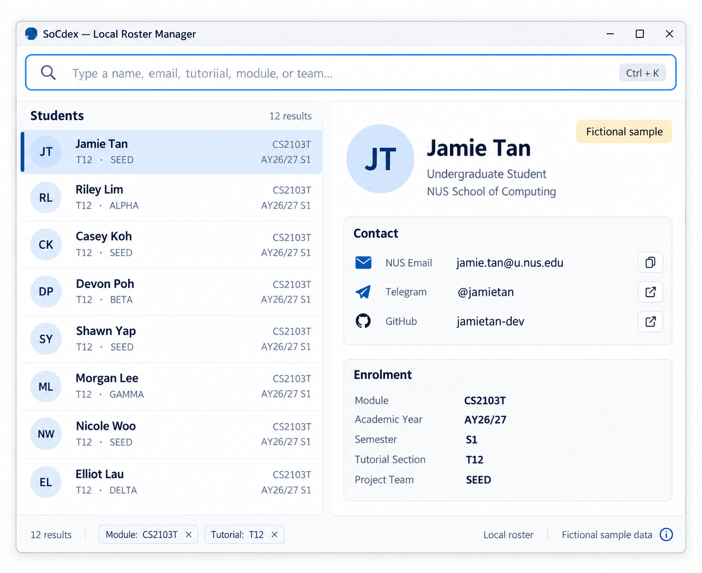

SoCdex is a desktop roster manager for NUS School of Computing tutors who manage students across multiple class sections and project teams. It keeps student identities and roster information in one local application, so tutors do not need to repeatedly cross-reference Canvas, spreadsheets, technical platforms, and personal notes. SoCdex provides a keyboard-first workflow through typed commands while retaining the benefits of a graphical user interface.

SoCdex is based on AddressBook Level 3 (AB3).

* Table of Contents
{:toc}

--------------------------------------------------------------------------------------------------------------------

## Quick start

1. Ensure that Java `25` or later is installed on your computer. 
   **Mac users:** Ensure you have the precise JDK version prescribed [here](https://se-education.org/guides/tutorials/javaInstallationMac.html).

1. Download the latest `.jar` file from the [SoCdex releases page](https://github.com/AY2627S1-CS2103T-W09-2/tp/releases).

1. Copy the file to the folder where you want SoCdex to store its data.

1. Open a terminal, `cd` to the folder containing the JAR file, and run `java -jar addressbook.jar`. 
   A GUI should appear in a few seconds. A new installation starts with an empty roster; it does not create sample records automatically. The image below illustrates the planned interface. 
   

1. Type a command in the command box and press Enter to execute it. For example, type **`help`** and press Enter to open the help window. 
   Some example commands you can try:

   * `list` : Lists all contacts.

   * `student add /name Alex Tan /email e9000001@u.nus.edu` : Creates a student profile without requiring optional contacts.

   * `sample load` : Loads five fictional student profiles into an empty roster.

   * `delete 3` : Deletes the 3rd contact shown in the current list.

   * `clear` : Deletes all contacts.

   * `exit` : Exits the app.

1. Refer to the [Features](#features) section below for details of each command.

--------------------------------------------------------------------------------------------------------------------

## Features

**:information_source: Notes about the command format:** 

* Words in `UPPER_CASE` represent your values. Square brackets mark optional parameters; do not type the brackets.
* Use lowercase command words and prefixes. Commands must be on one line; spaces and tabs may separate their components.
* For `student add` and `edit`, prefixes may appear in any order, but only once each. Separate each prefix from its value with a space or tab. Unknown prefixes, repeated prefixes, empty supplied values, malformed slash tokens and text before the first prefix are rejected with usage guidance.
* A prefix starts at a space/tab boundary with `/` and a letter, followed by letters or hyphens. Values end at the next prefix. An embedded slash such as the one in `AY26/27` is not a prefix.

* Extraneous parameters for commands that take no parameters, such as `help`, `list`, `exit`, and `clear`, are ignored. 
  For example, `help 123` is interpreted as `help`.
  `sample load` is an exception. It rejects all extra parameters.

* If you are using a PDF version of this document, be careful when copying and pasting commands that span multiple lines as space characters surrounding line-breaks may be omitted when copied over to the application.

### Viewing help: `help`

Shows a message explaining how to access the help page.

Format: `help`

### Loading fictional sample profiles: `sample load`

Loads a fixed set of five fictional student profiles and five enrolments, so you can explore SoCdex without entering real student data.

Format: `sample load`

The roster must be empty and writable. The command accepts extra spaces or tabs around and between `sample` and `load`, but it does not accept any parameters. The command is lowercase and must be on one line.

The fixture contains these fictional profiles:

* Alex Tan, `e9000001@u.nus.edu`, with Telegram and GitHub contacts, and two enrolments.
* Alex Tan, `e9000002@u.nus.edu`, with a GitHub contact and one enrolment.
* Mei Lim, `e9000003@u.nus.edu`, with a Telegram contact and one enrolment.
* Nur Aisyah, `e9000005@u.nus.edu`, with no optional contacts or enrolments.
* Ravi Kumar, `e9000004@u.nus.edu`, with Telegram and GitHub contacts, and one enrolment.

Every loaded profile shows the `Fictional sample` label. Missing contacts show `Not provided`. Missing section and team values are stored as absent; detailed enrolment display is a separate feature increment. Display labels are not stored as data. The five profiles appear in name order, with email used to order equal names. No profile is selected automatically, and the prompt says `Select a student to view their profile.` The fixture is saved and returns after restart.

A successful command shows `Loaded 5 fictional student profiles and 5 enrolments. You can explore SoCdex without using real student data.`

If the roster is not empty, SoCdex shows `Sample data can only be loaded into an empty roster. Existing data was not changed.` It does not add, merge, or replace any profile. If the fixed fixture is invalid, SoCdex shows `Sample data is invalid. No data was changed.` If saving fails, it shows `Sample data could not be saved. No data was changed.` These failures keep the previous roster and saved file unchanged. A read-only recovery session rejects the command with the existing recovery message.

SoCdex does not load samples at startup. `sample clear` is planned for v1.3 and is not available in v1.2. The existing `clear` command deletes the whole roster, including real profiles, so it is not a safe selective replacement for `sample clear` in a mixed roster.

### Adding a student: `student add`

Format: `student add /name NAME /email EMAIL [/telegram HANDLE] [/github USERNAME]`

Only name and email are required. The new profile is non-sample and has no enrolments. A successful command shows `Added student: NAME.`, displays the full roster sorted by name (ignoring case) then email, and selects the new student.

* Names may contain 1 to 100 Unicode characters, including accented and non-Latin names. Surrounding spaces/tabs are removed and internal runs become one space. Names must contain a visible character and cannot contain a slash, line break or control character. Two students may have the same name.
* Emails have a local part of 1 to 64 ASCII letters, digits, dots, underscores, plus signs or hyphens followed by exactly `@u.nus.edu`. The local part must start and end with a letter or digit and cannot contain consecutive dots or spaces. Input is lowercased and surrounding spaces/tabs are removed. Dots and plus suffixes remain significant: `alex+one@u.nus.edu` and `alex+two@u.nus.edu` are different identities.
* Telegram handles contain 5 to 32 ASCII letters, digits or underscores and start with a letter. One leading `@` is accepted and removed. Letter case is preserved.
* GitHub usernames contain 1 to 39 ASCII letters, digits or hyphens. They start and end with a letter or digit and cannot contain consecutive hyphens. A leading `@`, underscore or URL is not accepted. Letter case is preserved.
* Omit an unknown contact entirely. A supplied empty contact is an error. `Not provided` is displayed for absent contacts and is never stored as a placeholder.
* Syntax checks do not verify that any institutional, Telegram or GitHub account exists. No external service is contacted.

Examples using fictional students:

* `student add /name José Tan /email E9000001@U.NUS.EDU` stores the email as `e9000001@u.nus.edu`.
* `student add /email e9000002@u.nus.edu /name 王小明 /telegram @Alex_Tan /github alex-tan` accepts mixed prefix order and stores Telegram as `Alex_Tan`.
* `student add /name José Tan /email e9000003@u.nus.edu` creates a second student with the same name and a different email.

If the canonical email already exists, the command shows `A student with this NUS email already exists.` and reveals/selects that existing student in the full sorted roster. It does not overwrite or save any data. This deliberate reveal is the exception to preserving the previous selection on rejection. `view` guidance will be added when that command is available.

A save failure shows `The student could not be saved. No data was changed.` and restores the previous roster, results and selection. Correct the storage problem and retry. If the new display cannot be prepared, the command shows `Student could not be displayed. No data was changed. Try again.` and does not save.

The inherited `add n/...` command is retired. Phone and address are no longer student fields.

### Adding a module-semester enrolment: `enrol`

Format: `enrol /email EMAIL /module MODULE /semester SEMESTER [/section SECTION] [/team TEAM]`

Create the student first with `student add`. The normalised NUS email selects the exact owner from the complete roster, including students hidden by a search. Prefixes may appear in any order, once each. Unknown or repeated prefixes, text before the first prefix and supplied empty values reject the whole command. The slash inside `AY26/27` is part of the semester value.

* Module codes have 2 to 4 ASCII letters, four digits and up to 3 final letters; input is trimmed and stored uppercase.
* Semesters use `AYyy/yy S1` or `AYyy/yy S2`, ignoring case and normalising spaces/tabs. Years must be consecutive within 2000–2099. Special terms are unsupported.
* Optional section and team labels have 1 to 30 ASCII letters, digits, spaces or hyphens after spaces/tabs are normalised, and need at least one letter or digit. Case is preserved. Omit a prefix for an unknown affiliation; do not supply a blank value or store `Not assigned` as a placeholder.

Examples using an existing fictional student:

* `enrol /email e9000001@u.nus.edu /module CS2103T /semester AY26/27 S1` adds an unassigned context.
* Alternatively, `enrol /email E9000001@U.NUS.EDU /module cs2103t /semester ay26/27 s1 /section T12 /team SEED` adds the same context with affiliations. Run either example, not both: the second is a duplicate after the first succeeds.
* `enrol /semester AY26/27 S2 /module CS2103T /email e9000001@u.nus.edu` adds a separate context for the next semester.

Success shows `Added enrolment for NAME: MODULE, SEMESTER.` followed by `Module:`, `Semester:`, `Section:` and `Team:` lines for the saved context. Missing affiliations display `Not assigned`. The change is saved before success is reported; the active search is cleared and the owner is selected in the full roster sorted by name then email. All contacts, sample classification, earlier enrolments and other students are preserved. Complete profile/enrolment presentation remains a separate increment.

A duplicate module-semester key for the same student is rejected even if section or team differs. The specified message says `This student already has an enrolment for MODULE, SEMESTER. Use edit-enrol to change its section or team.` **`edit-enrol` is planned optional work and is currently unavailable.** Check the context before retrying; `enrol` never overwrites existing affiliations. Different students may share the same context.

A missing owner shows `No student found with NUS email: EMAIL. Create the student profile before adding an enrolment.` Invalid values show their field rule. Syntax errors include usage help and report structural errors from left to right, then check values in email/module/semester/section/team order. Rejections leave data, results and selection unchanged.

A save failure shows `The enrollment could not be saved. No data was changed.` and restores the previous roster, results and selection. Correct the storage problem and retry. A display preparation failure shows `Student could not be displayed. No data was changed. Try again.` and does not save. Read-only recovery sessions reject enrolment changes with the existing recovery guidance.

### Listing all persons: `list`

Shows a list of all persons in the address book.

Format: `list`

### Editing optional contacts: `edit`

Format: `edit /email EMAIL [/telegram HANDLE|clear] [/github USERNAME|clear]`

The email selects an existing student across the complete roster, even when a search hides that student. Supply at least one contact field. Omission preserves that contact, the exact lowercase token `clear` removes it, and an empty supplied value is invalid. Contact validation is the same as for `student add`.

* `edit /email e9000001@u.nus.edu /telegram @Alex_New` updates Telegram and preserves GitHub.
* `edit /email e9000001@u.nus.edu /github clear` removes GitHub.
* `edit /email e9000001@u.nus.edu /telegram @clear /github Clear` stores the literal handles `clear` and `Clear`. In creation, `clear` is ordinary text; clearing applies only to this edit command.

Success shows `Updated student: NAME.`, clears the search filter, displays the full sorted roster and selects the updated student. Name, email, enrolments, sample status, tags and remark are preserved. Identical normalised values or clearing an absent contact show `No values changed.`, still reveal/select the target, and do not rewrite the roster. Case-only contact changes are real changes and are saved.

A missing target shows `No student found with NUS email: EMAIL.`; a command without editable fields shows `Provide at least one field to update.` Invalid input preserves the previous data, results and selection. A save failure shows `The record could not be updated. No data was changed.` and restores the prior state. Presentation failure uses the same no-change display message as creation.

Index-based `edit`, `/name`, `/new-email`, and affiliation editing are not supported in this increment. Name/email and affiliation editing remain planned for v1.3.

### Finding students by an identifier: `find`

Search the complete roster using a name, NUS email, Telegram handle, GitHub username, or part of any identifier.

Format: `find QUERY`

* Enter one literal query of 1 to 100 Unicode characters. `find Alex Tan` searches for the phrase `Alex Tan`; it does not match `Alex Lim` or `Mei Tan`.
* Matching ignores letter case and checks the whole query as a contiguous substring in any of the four fields. Accents remain significant, and punctuation such as `*` is literal; wildcards and regular expressions are not supported.
* Surrounding spaces and tabs are ignored. Internal tabs become spaces, and repeated internal spaces remain significant. For example, `find Alex  Tan` (two spaces) does not match `Alex Tan` (one space).
* For Telegram only, one leading `@` is removed from the query. `find @` has no Telegram match but still matches email addresses. Names, emails and GitHub usernames use the original query, so `find @socdex-demo-ravi` does not match GitHub username `socdex-demo-ravi`.
* Absent contacts do not match the display label `Not provided`. Enrolment fields and the `Fictional sample` label are not searched.
* Every search starts from the complete roster, including students hidden by a previous search.
* Results appear in name order, ignoring case, with email used to break ties. Each matching profile appears once and shows its name, email, and currently supported fields.
* A single match is selected automatically. Zero or multiple matches clear the selection.
* A blank query shows `Enter a name, NUS email, Telegram handle, or GitHub username to search.` with usage help. More than 100 characters, a line break, or an unsupported control character is also rejected. The previous results and selection remain available; correct the command and retry.
* Searching does not change or save roster data.
* If results cannot be displayed, the app shows `Search results could not be displayed. Try the search again.` and retains the previous results and selected profile. Retry the search.

Examples using fictional records:

* `find Alex Tan` finds every profile with an identifier containing `Alex Tan`.
* `find E9000001@U.NUS.EDU` finds a profile with the email `e9000001@u.nus.edu`, even after an earlier search returned no results.
* `find @u.nus.edu` lists matching student emails.
* After `sample load`, `find @socdex_demo_mei` selects Mei Lim through Telegram, and `find socdex-demo-ravi` selects Ravi Kumar through GitHub. Shared handles return every matching student once, even when another field also matches.
* `find *` searches for a literal asterisk. If no profile matches, the app displays `No students found for "*". Check the spelling or search with another identifier.`

Complete enrolment details and the `view EMAIL` command are delivered separately; this increment displays the fields currently available on each result card.

If the student list cannot be refreshed after a command, the app blocks further command execution until it can show the current list. Submit again to refresh it, then check the displayed indexes before re-entering your intended command. The earlier command may already have changed data; refreshing the list does not repeat it.

### Deleting a person: `delete`

Deletes the specified person from the address book.

Format: `delete INDEX`

* Deletes the person at the specified `INDEX`.
* The index refers to the index number shown in the displayed person list.
* The index **must be a positive integer** 1, 2, 3, …​

Examples:
* `list` followed by `delete 2` deletes the 2nd person in the address book.
* `find Betsy` followed by `delete 1` deletes the 1st person in the results of the `find` command.

### Clearing all entries: `clear`

Clears all entries from the address book.

Format: `clear`

### Exiting the program: `exit`

Exits the program.

Format: `exit`

### Saving the data

SoCdex saves roster changes before reporting success. You do not need to save manually. Read-only commands (`find`, `list`, `help`, and `exit`), rejected commands, and changes that leave all stored values unchanged do not rewrite the roster file.

If saving fails, the app reports that no data was changed and restores the previous roster, result list, and selected profile. Correct the file or folder permissions, or free disk space, then retry. A failed first save does not create a partial roster file. If the filesystem cannot safely replace the file, saving fails instead of overwriting it in place; use a local filesystem that supports atomic file replacement.

This protects against detected loading and saving failures. It does not provide backups, undo, or guarantees against hardware failure or power loss. Use only one running instance for a roster and do not edit its file while the app is running.

### Starting empty or recovering from a load failure

When no saved roster exists, the app starts empty and explains how to add a student or load fictional samples. Use `student add` to enter your own record, or use `sample load` to explore the fixed fictional fixture. Samples do not load automatically.

If an existing roster is unreadable or invalid, the app preserves it and opens an empty **read-only recovery session**. The initial message is:

> Stored data could not be loaded. The existing file was preserved. This session is read-only. Restore a valid data file and restart SoCdex.

**Storage unavailable — read-only recovery** remains visible in the status bar, including after searches. An empty recovery view does not mean that the saved roster is empty. Data-changing commands are disabled for the entire session. Searching, listing, help, and exiting remain available. Closing the app does not overwrite the preserved roster.

To recover:

1. Close the app and keep a separate copy of the preserved file before making repairs.
1. Restore a known-valid roster to the displayed data-file location, or correct invalid records and file permissions while the app is closed.
1. Restart SoCdex. Confirm that the expected records load and the status says **Storage available** before making changes.

### Stored enrolments

Student records can store several module-semester enrolments, with optional tutorial sections and project teams. Use `enrol` to add a context to an existing student. Complete profile display remains a separate increment. Existing commands that edit a profile or its remark preserve its stored enrolments.

An otherwise valid older profile without an `enrolments` property loads with no enrolments. When editing JSON while the app is closed, use the canonical enrolment format documented in the Developer Guide. Invalid values or duplicate module-semester keys reject the entire load. Keep a separate copy of the file before editing it. Do not store `Not assigned` as a substitute for an absent section or team; use null or omit that optional property.

### Stored contacts and sample classification

`student add` creates a non-sample profile with optional contacts; `edit /email` changes only the supplied contacts. `sample load` creates the fixed classified fictional fixture only in an empty roster. Each saved record explicitly states whether it is fictional sample data. Existing remark and enrolment-copy operations preserve that classification and the contacts.

Each result card shows a `Telegram:` line and a `GitHub:` line. `Not provided` means that no value is stored; it is display text only. A fictional sample record also shows the label `Fictional sample`.

### Editing the data file

**Schema compatibility:** files containing the retired `phone` or `address` properties are rejected, even when those properties are null. No data is silently dropped. Keep an external copy of the original file, close the app, and manually migrate only after retaining any phone/address information you need elsewhere. Remove the retired properties, explicitly classify each record with a boolean `sample`, and verify all fields against the rules below before restarting. The app never guesses classification or automatically migrates a file. An otherwise valid record that omits optional contacts or enrolments loads with those values absent or empty.

Roster data is saved automatically as a JSON file `[JAR file location]/data/addressbook.json`. Advanced users are welcome to update data directly by editing that data file.

Names in the data file must already have ordinary spaces and tabs normalised: no surrounding ordinary spaces or tabs, no tabs within the name, and no repeated ordinary spaces. Letter case and other permitted Unicode characters, including non-breaking spaces, are preserved. Commands normalise ordinary spaces and tabs, but the app rejects a stored name that needs this normalisation instead of correcting it.

Every record must contain `"sample": false` or `"sample": true`, written as a JSON boolean rather than text. Use `false` for real students and `true` only for fictional sample records. The `"telegram"` and `"github"` properties are optional; omit them or write `null` when there is no value. A stored value must already be in its saved form, with no surrounding spaces or tabs. A Telegram handle has 5 to 32 letters, digits, or underscores, starts with a letter, and is stored without its leading `@` (write `"alex_tan"`, not `"@alex_tan"`). A GitHub username has 1 to 39 letters, digits, or single hyphens, and does not start or end with a hyphen. Letter case is kept as written. Never store `Not provided` as a value. A missing or non-boolean `sample`, or a contact value that is invalid or not in its saved form, rejects the entire load.

:exclamation: **Caution:**
Edit the file only while the app is closed, and keep a separate copy before editing it. If your changes make it invalid, SoCdex preserves it and opens a read-only recovery session at the next run. Restore a valid file and restart; commands and normal exit do not replace the invalid roster. 
Furthermore, certain edits can cause the AddressBook to behave in unexpected ways (e.g., if a value entered is outside of the acceptable range). Therefore, edit the data file only if you are confident that you can update it correctly.

### Archiving data files `[coming in v2.0]`

_Details coming soon ..._

--------------------------------------------------------------------------------------------------------------------

## FAQ

**Q**: How do I transfer my data to another computer? 
**A**: Install the app on the other computer and overwrite the data file it creates with the data file from your previous AddressBook home folder.

**Q**: Why does my data file from an earlier version no longer load? 
**A**: Every email must now be a valid NUS email (see `student add`), and no two persons can share an email. In the data file, each email must also already be in its saved form: all lowercase, with no spaces or tabs before or after it. Commands such as `student add` convert uppercase letters and remove surrounding spaces and tabs, but the app does not convert emails in the data file. A data file that contains another kind of email address (such as one ending in `@example.com`), an email that is not in its saved form (such as `E1234567@u.nus.edu`), or two persons with the same email is treated as an invalid data file. SoCdex then preserves the file and opens a read-only recovery session; see [Starting empty or recovering from a load failure](#starting-empty-or-recovering-from-a-load-failure). Keep a copy of the original file, then correct each email or remove the duplicate record while the app is closed, and restart SoCdex.

**Q**: Why does a data file saved by an earlier SoCdex build open in read-only recovery even though its emails are valid? 
**A**: Every record must now state whether it is fictional sample data. A file saved before this change has no `"sample"` property in its records, so SoCdex preserves it and opens a read-only recovery session instead of guessing; see [Starting empty or recovering from a load failure](#starting-empty-or-recovering-from-a-load-failure). To use the file again, close SoCdex and keep a copy of the file. Add `"sample": false` to every record that describes a real student (use `"sample": true` only for fictional sample records), then restart SoCdex. See [Editing the data file](#editing-the-data-file) for the format.

--------------------------------------------------------------------------------------------------------------------

## Known issues

1. **When using multiple screens**, if you move the application to a secondary screen, and later switch to using only the primary screen, the GUI will open off-screen. The remedy is to delete the `preferences.json` file created by the application before running the application again.
2. **If you minimize the Help Window** and then run the `help` command (or use the `Help` menu, or the keyboard shortcut `F1`) again, the original Help Window will remain minimized, and no new Help Window will appear. The remedy is to manually restore the minimized Help Window.

--------------------------------------------------------------------------------------------------------------------

## Command summary

Action | Format, Examples
--------|------------------
**Enrol** | `enrol /email EMAIL /module MODULE /semester SEMESTER [/section SECTION] [/team TEAM]`
**Student add** | `student add /name NAME /email EMAIL [/telegram HANDLE] [/github USERNAME]`
**Clear** | `clear`
**Delete** | `delete INDEX`  e.g., `delete 3`
**Edit** | `edit /email EMAIL [/telegram HANDLE\|clear] [/github USERNAME\|clear]`
**Find** | `find QUERY`  e.g., `find Alex Tan`
**List** | `list`
**Help** | `help`
**Sample load** | `sample load`
